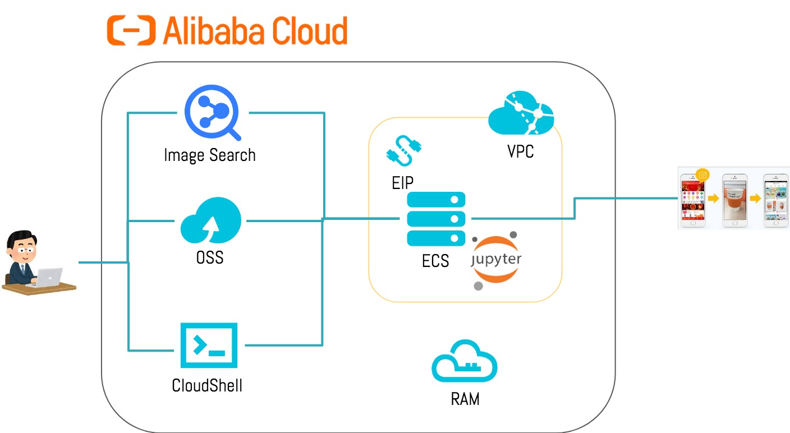

# インフラ構成
###### 5min

## インフラ構成図
本ハンズオンでは、Alibaba Cloud日本サイト上に、Image Search、画像検索を行うアプリのECSサーバー、画像置き場のOSSを構築します。

Image Search自体は画像情報（画像ファイル名やメタデータ）を返却するサービスであるため、画像をユーザーに表示させる場合、別途画像を保存する場所が必要となります。一般的な画像アプリは、画像枚数が多くなることを前提に、アプリサーバーの負荷軽減と冗長性を考慮して、アプリサーバーとは別の場所に画像を保存をします。

Image Searchに集中してもらいため、環境構築は全てブラウザ上からできるようにしています。[Step1](Step1.md)から[Step5](Step5.md)までが環境構築となります。

## リージョン
国や地域を表すAlibaba Cloudの拠点です。本ハンズオンでは複数のリージョンに分散してインフラ構築をしてもらいます。使用するリージョンは次の通りです。
| リージョン名 | 英語表記 | 付箋の色 |
|:-----:|:------------:|:------------:|
| 中国（香港） | cn-hongkong | ピンク色 |
| シンガポール | ap-southeast-1 | 黄色 |
| オーストラリア（シドニー） | ap-southeast-2 | 緑色 |
| 日本（東京） | ap-northeast-1 | 青色 |

## 参考
- [【初心者向け】AlibabaCloud入門 ークラウドはじめの一歩](https://www.slideshare.net/sbcloud/alibabacloud)
- [Alibaba Cloudセキュリティベストプラクティス](https://www.slideshare.net/sbcloud/alibaba-cloud)
- [リージョンの英語表記](https://jp.alibabacloud.com/help/doc-detail/40654.htm)

[戻る](README.md) | [次へ](Step1.md)
