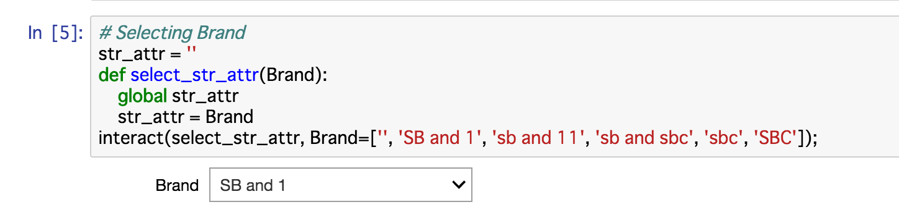
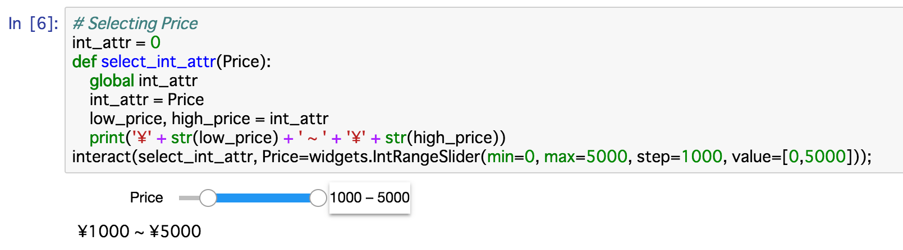
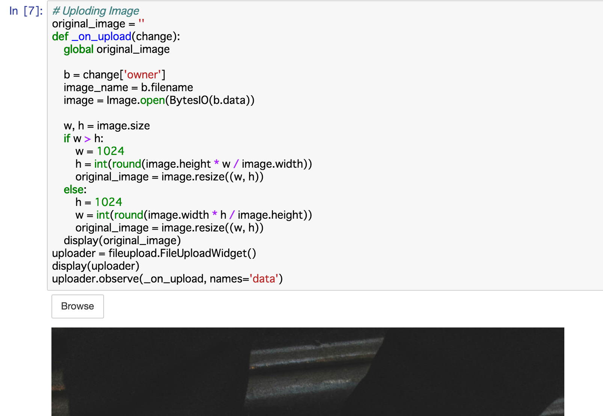
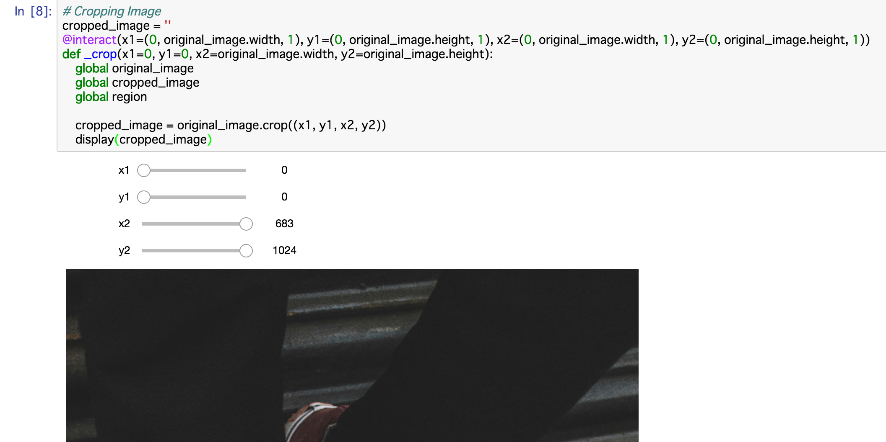
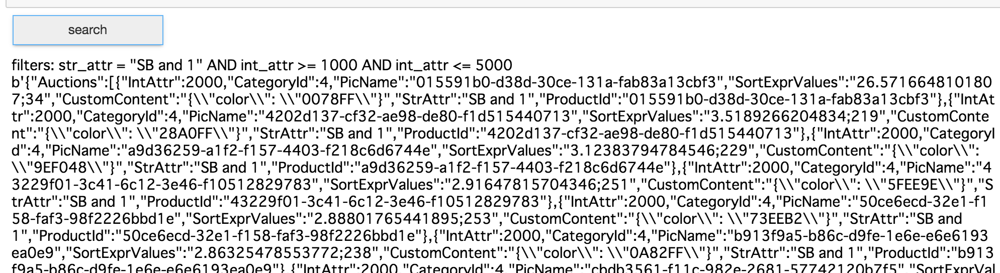
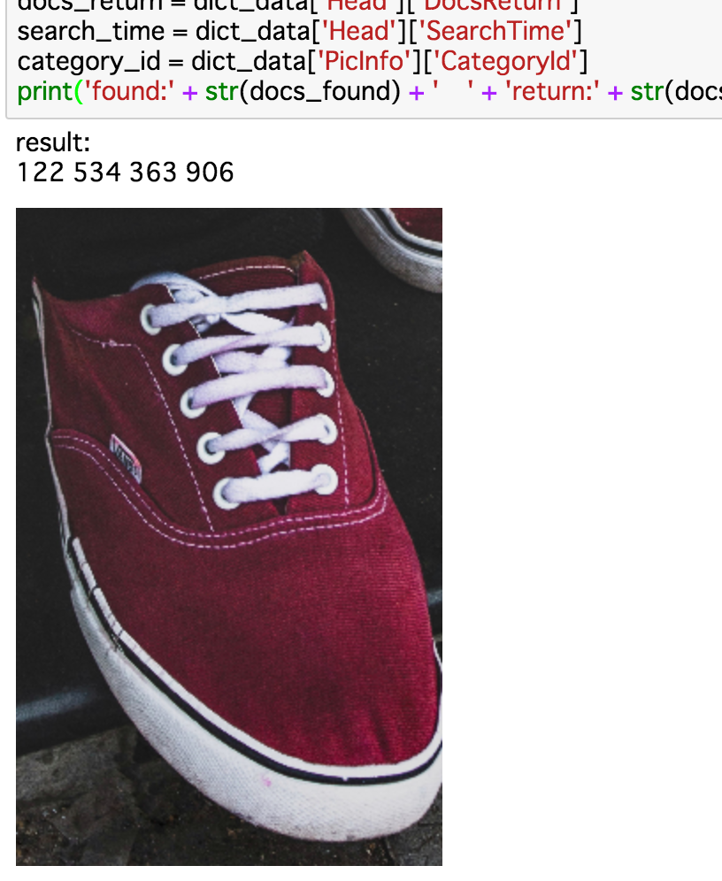
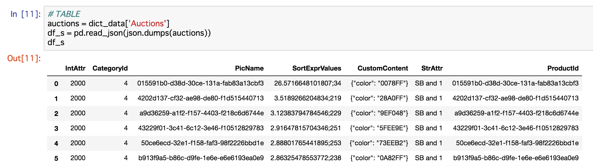
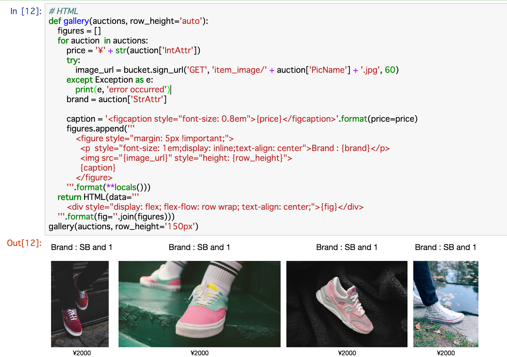

# Image Searchで画像検索
###### 40min

## サンプル画像をダウンロード
Image Searchをすぐに試してもらうために、検索をするサンプル画像を13枚用意しました。ローカルPCにダウンロードしてお使いください。
1. `http://<<ECSインスタンスのIPアドレス>>:8888/tree/home/jupyter/jupyter-working/sample_image` にアクセスします。
1. チェックボックスをつけ、画像を1枚ずつダウンロードしてください。

## Notebookを起動
1. `http://<<ECSインスタンスのIPアドレス>>:8888/tree/home/jupyter/jupyter-working` にアクセスします。
1. 右上の *New* ボタンを押下し、*Python3* を選択します。
1. Notebookに名前 `searchImages` をつけます。

## 画像検索
本ステップではJupyter Notebookに画像をアップロードし、検索条件をつけてアップロードされた画像の類似画像を検索します。以降、手順ごとにソースをNotebookのCellに貼っていき、*shift + Enter* をしてください。
1. 必要なライブラリを読み込みます。
    ```
    from IPython.display import HTML, display
    from ipywidgets import interact
    from aliyunsdkcore.client import AcsClient
    from PIL import Image
    from io import BytesIO
    import ipywidgets as widgets
    import base64
    import pandas as pd
    import os
    import oss2
    import json
    import fileupload
    import aliyunsdkimagesearch.request.v20190325.SearchImageRequest as SearchImageRequest
    ```
1. 環境変数を読み込みます。
    ```
    # Setting ENV
    access_key_id = os.environ['ACCESS_KEY_ID']
    access_key_secret = os.environ['ACCESS_KEY_SECRET']
    region = os.environ['REGION']
    bucket_name = os.environ['BUCKET_NAME']
    imagesearch_instance_name = os.environ['IMAGESEARCH_INSTANCE_NAME']
    ```
1. OSSクライアントをセットアップします。
    ```
    # OSS
    oss_endpoint = 'oss-' + region + '.aliyuncs.com'
    auth = oss2.Auth(access_key_id, access_key_secret)
    bucket = oss2.Bucket(auth, oss_endpoint, bucket_name)
    item_data_file_name = 'item_data.csv'
    ```
1. Image Searchクライアントをセットアップします。
    ```
    # Image Search
    imagesearch_endpoint = 'imagesearch.' + region + '.aliyuncs.com'
    client = AcsClient(access_key_id, access_key_secret, region)
    ```
1. 検索条件に文字列型属性としてブランド名を付与します。実行後、プルダウンが表示されるので任意のブランド名を選択してください。選択後の再実行は不要です。
    ```
    # Selecting Brand
    str_attr = ''
    def select_str_attr(Brand):
        global str_attr
        str_attr = Brand
    interact(select_str_attr, Brand=['', 'SB and 1', 'sb and 11', 'sb and sbc', 'sbc', 'SBC']);
    ```
    1. 実行結果例
        
1. 検索条件に整数型属性として価格を付与します。実行後、つまみが表示されるので任意に調節してください。調節後の再実行は不要です。
    ```
    # Selecting Price
    int_attr = 0
    def select_int_attr(Price):
        global int_attr
        int_attr = Price
        low_price, high_price = int_attr
        print('¥' + str(low_price) + ' ~ ' + '¥' + str(high_price))
    interact(select_int_attr, Price=widgets.IntRangeSlider(min=0, max=5000, step=1000, value=[0,5000]));
    ```
    1. 実行結果例
        
1. 画像アップロードフォームを作ります。実行後、フォームが表示されるので、ダウンロードしたサンプル画像を1枚アップロードしてください。アップロード後の再実行は不要です。アップロード後は画像が表示されますが、やや時間がかかります。Jupyter Notebookは画像処理速度を追い求めたソフトウェアではないので目を瞑ってください。
    ```
    # Uploding Image
    original_image = ''
    def _on_upload(change):
        global original_image

        b = change['owner']
        image_name = b.filename
        image = Image.open(BytesIO(b.data))

        w, h = image.size
        if w > h:
            w = 512
            h = int(round(image.height * w / image.width))
            original_image = image.resize((w, h))
        else:
            h = 512
            w = int(round(image.width * h / image.height))
            original_image = image.resize((w, h))
        display(original_image)
    uploader = fileupload.FileUploadWidget()
    display(uploader)
    uploader.observe(_on_upload, names='data')
    ```
    1. 実行結果例
        
1. 検索条件に画像の範囲を付与します。実行後、左上を原点とした *x1, y1* と右下を原点とした *x2, y2* のつまみ4つと画像が表示されるので任意にトリミングしてください。トリミング後の再実行は不要です。
    ```
    # Cropping Image
    cropped_region_list = []
    @interact(x1=(0, original_image.width, 1), y1=(0, original_image.height, 1), x2=(0, original_image.width, 1), y2=(0, original_image.height, 1))
    def _crop(x1=0, y1=0, x2=original_image.width, y2=original_image.height):
        global original_image
        global cropped_region_list

        cropped_image = original_image.crop((x1, y1, x2, y2))
        cropped_region_list = [x1, x2, y1, y2]
        display(cropped_image)
    ```
    1. 実行結果例
        
1. 画像検索関数を定義します。実行後に *search* ボタンが表示されるので押下してください。主な処理内容は以下の通りです。
    1. 検索条件を変数にセットします。各変数に入っている値の例を上げます。
    |変数名|値|意味|
    |:---|:---|:---|
    |`str_attr`|`SB and 1`|文字列型属性|
    |`int_attr`|`[1000,5000]`|整数型属性|
    |`filters`|`str_attr = "SB and 1" AND int_attr >= 1000 AND int_attr <= 5000`|フィルター条件|
    |`cropped_region`|`[0, 683, 0, 1024]`|画像の被写体範囲|
    |`returned_items_number`|`2000`|検索結果の戻り値の数|
    |`encoded_pic_content`|`data:image/jpeg;base64,/9j/4AAQ...`|Base64でエンコードした画像|    
    1. [画像検索に必要なパラメータ](https://jp.alibabacloud.com/help/doc-detail/113680.htm)をHTTPリクエストにセットし、画像検索HTTPリクエストを送ります。
    ```
    # Sending request to Image Search
    api_result = ''
    def _on_button_clicked(change):
        global api_result

        # str_attr
        filters = ''
        if str_attr != '':
            filters = 'str_attr = ' +  '"'+ str_attr + '"'

        # int_attr
        if filters != '':
            filters += ' AND '
        low_price, high_price = int_attr
        if low_price != high_price:
            filters += 'int_attr >= ' + str(low_price) + ' AND int_attr <= ' + str(high_price)
        else:
            filters += 'int_attr = ' + str(low_price)
        print('filters: ' + filters)

        # region
        cropped_region = ','.join(cropped_region_list)

        # returned items number
        returned_items_number = 20

        # image
        buf = BytesIO()
        cropped_image.save(buf, format='jpeg')        
        encoded_pic_content = base64.b64encode(buf.getvalue())

        # sending request
        request = SearchImageRequest.SearchImageRequest()
        request.set_endpoint(imagesearch_endpoint)
        request.set_InstanceName(imagesearch_instance_name)
        request.set_Filter(filters)
        request.set_Region(cropped_region)
        request.set_Num(returned_items_number)
        request.set_PicContent(encoded_pic_content)

        try:
            response = client.do_action_with_exception(request)
        except Exception as e:
            print(e, 'error occurred')
        api_result = response
        print('API Response:')
        print(api_result)

    button = widgets.Button(description="search")
    display(button)
    button.on_click(_on_button_clicked)
    ```
    1. 実行結果例
        
    1. *search* ボタン押下後例
        
1. 画像検索HTTPレスポンスを整形して、検索結果をまとめます。
    1. 検索結果の例を上げます。
    |変数名|値|意味|
    |:---|:---|:---|
    |`docs_found`|`13091`|検索結果の総数|
    |`docs_return`|`20`|検索結果の戻り値の数|
    |`search_time`|`164`|検索時間（単位はミリ秒）|
    |`category_id`|`[0, 683, 0, 1024]`|画像カテゴリID|
    |画像|-|検索に使用された画像の範囲でアップロードした画像をトリミングしたもの|

    ```
    # ETL
    dict_data = json.loads(api_result)
    x1, x2, y1, y2 = [int(t) for t in dict_data['PicInfo']['Region'].split(',')]
    print('Result:')
    docs_found = dict_data['Head']['DocsFound']
    docs_return = dict_data['Head']['DocsReturn']
    search_time = dict_data['Head']['SearchTime']
    category_id = dict_data['PicInfo']['CategoryId']
    print('Found:' + str(docs_found) + '    ' + 'Return:' + str(docs_return) + '    ' + 'time:' + str(search_time) + '(s)' + '    ' + 'category_id:' + str(category_id))
    display(original_image.crop((x1, y1, x2, y2)))
    ```
    1. 実行結果例
        
1. 検索結果の画像情報を表形式にまとめます。
    ```
    # TABLE
    auctions = dict_data['Auctions']
    df_s = pd.read_json(json.dumps(auctions))
    df_s
    ```
    1. 実行結果例
        
1. 検索結果の画像情報を元に、OSSバケットから画像の有効期限付きの署名付きURLを発行し、URLをHTMLに埋め込んで画像を表示します。
    ```
    # HTML
    def gallery(auctions, row_height='auto'):
        figures = []
        for auction  in auctions:        
            price = '¥' + str(auction['IntAttr'])
            try:
                image_url = bucket.sign_url('GET', 'item_image/' + auction['PicName'] + '.jpg', 60)
            except Exception as e:
                print(e, 'error occurred')
            brand = auction['StrAttr']

            caption = '<figcaption style="font-size: 0.8em">{price}</figcaption>'.format(price=price)
            figures.append('''
                <figure style="margin: 5px !important;">
                  <p  style="font-size: 1em;display:　inline;text-align: center">Brand : {brand}</p>
                  
                  {caption}
                </figure>
            '''.format(**locals()))
        return HTML(data='''
            <div style="display: flex; flex-flow: row wrap; text-align: center;">{fig}</div>
        '''.format(fig=''.join(figures)))
    gallery(auctions, row_height='150px')
    ```
    1. 実行結果例
        
1. 再検索をしたい場合は `5.` 以降を全てを再実行してください。

## 参考
- [IPython API](https://ipython.readthedocs.io/en/stable/index.html)
- [ipywidgets API](https://ipywidgets.readthedocs.io/en/latest/index.html)
- [PIL API](https://pillow.readthedocs.io/en/3.1.x/index.html)
- [pandas API](https://pandas.pydata.org/pandas-docs/stable/index.html)
- [fileupload API](https://pypi.org/project/fileupload/)


[戻る](Step5.md) | [次へ](Step7.md)
